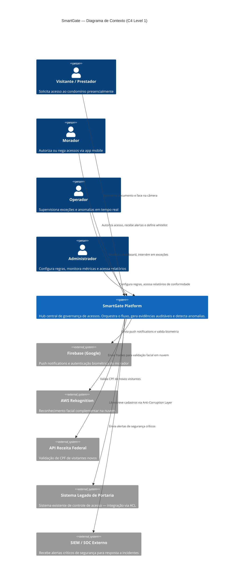
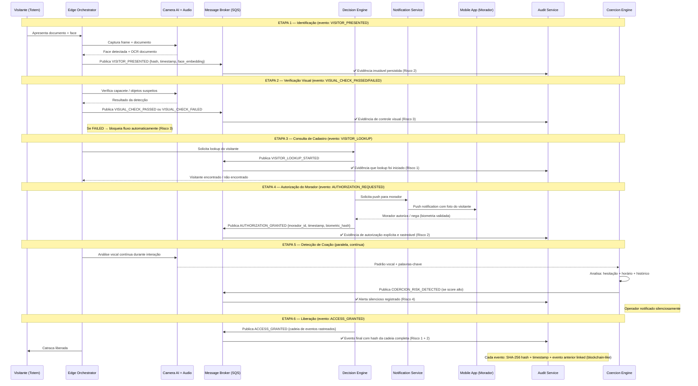
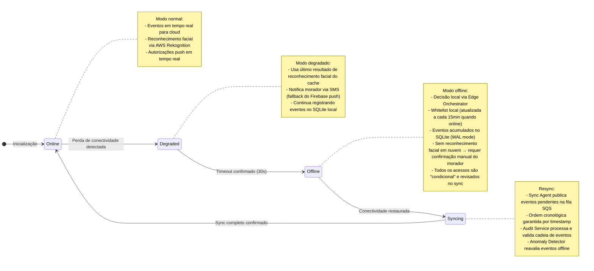
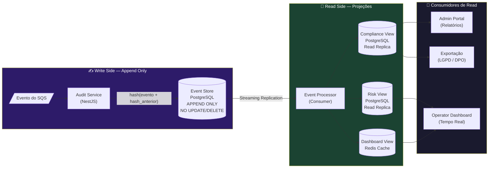

# SmartGate — Arquitetura do Software (Alto Nível)

> **Tech Challenge — Fase 5 | Enterprise Architecture & Liderança**  
> **Seção:** Arquitetura do Software (Alto Nível)  
> **Responsável:** Leonardo Turbiani — RM366050  
> **Grupo 18 | 2TCMT | PosTech FIAP**

---

## 1. Visão Arquitetural

A arquitetura do SmartGate foi projetada para eliminar os quatro riscos estruturais identificados no briefing: falta de garantia de processo, ausência de evidências auditáveis, falta de controle visual sistêmico e vulnerabilidade a cenários de pressão ou coação.

O princípio central que guia todas as decisões é:

> **"Controlar o processo, não apenas a entrada. Toda ação gera evidência. Nenhuma etapa pode ser pulada."**

Três decisões arquiteturais fundamentam toda a solução (documentadas nas ADRs ao final desta seção):

| Decisão | Por quê |
|---|---|
| **Offline-first no Edge** | Falha de conectividade não pode travar operações de segurança |
| **Arquitetura orientada a eventos** | Cada etapa do processo gera um evento imutável e auditável |
| **CQRS na camada de auditoria** | Separar escrita (append-only) de leitura (consultas de compliance) |

---

## 2. C4 Level 1 — Diagrama de Contexto

> **O quê:** mostra o SmartGate no contexto dos usuários e sistemas externos. É o mapa de "quem usa" e "com o que se conecta".



### Por que este contexto importa para os 4 riscos

| Ator / Sistema Externo | Risco que mitiga |
|---|---|
| Morador (app) | Risco 1 — autorização explícita registrada, não implícita |
| AWS Rekognition | Risco 3 — segunda camada de visão computacional na nuvem |
| SIEM / SOC | Risco 4 — escalation automático em cenários de coação |
| API Receita Federal | Risco 2 — evidência de validação documental auditável |

---

## 3. C4 Level 2 — Diagrama de Containers

> **O quê:** mostra os blocos tecnológicos deployáveis do SmartGate, suas responsabilidades e como se comunicam. Este é o nível que responde "como é construído".

```mermaid
C4Container
    title SmartGate — Diagrama de Containers (C4 Level 2)

    Person(morador, "Morador")
    Person(operador, "Operador")
    Person(visitante, "Visitante")

    System_Boundary(edge, "Edge Layer — Condomínio (NVIDIA Jetson Orin)") {
        Container(camera_ai, "Camera AI Module", "Python / YOLO v8 + OpenCV", "Detecção facial, capacete, objetos suspeitos. Roda localmente. Latência < 200ms.")
        Container(edge_orchestrator, "Edge Orchestrator", "Python / FastAPI", "Executa e valida cada etapa do fluxo de acesso. Garante que nenhuma etapa seja pulada.")
        Container(local_store, "Local Event Store", "SQLite + WAL mode", "Armazena eventos do fluxo offline-first. Sync com cloud quando conectado.")
        Container(sync_agent, "Sync Agent", "Python", "Sincroniza eventos pendentes com a nuvem via fila. Retry com backoff exponencial.")
        Container(audio_module, "Audio Analysis Module", "Python / Whisper (OpenAI)", "STT para NLP. Detecta palavras-chave de coação e padrões vocais atípicos.")
        Container(totem, "Totem de Acesso", "Raspberry Pi + Display", "Interface física para o visitante: câmera, microfone, tela de status.")
    }

    System_Boundary(cloud, "Cloud Layer — AWS (São Paulo / us-east-1)") {
        Container(api_gateway, "API Gateway", "NestJS + AWS API GW", "Ponto único de entrada. Rate limiting, autenticação JWT/OAuth2, roteamento.")
        Container(decision_engine, "Decision Engine", "NestJS + Bull Queue", "Orquestra o Saga de acesso. Valida cada etapa e publica eventos no broker.")
        Container(visitor_service, "Visitor Service", "NestJS", "CRUD de visitantes, whitelist de moradores, histórico de visitas.")
        Container(notification_service, "Notification Service", "NestJS + Firebase Admin", "Envia push notifications para moradores com deep link de autorização.")
        Container(audit_service, "Audit Service — Write", "NestJS + PostgreSQL (append-only)", "Persiste cada evento com hash SHA-256, timestamp imutável e assinatura. NUNCA faz UPDATE ou DELETE.")
        Container(audit_read, "Audit Read Service", "NestJS + PostgreSQL (read replica)", "Projeta views para relatórios de compliance. CQRS — separado do write.")
        Container(anomaly_detector, "Anomaly Detector", "Python / FastAPI + scikit-learn", "Detecta padrões anômalos: autorização fora do horário habitual, sequência de negações, comportamento vocal atípico.")
        Container(message_broker, "Message Broker", "AWS SQS + SNS", "Fila de eventos entre containers. Garante entrega pelo menos uma vez. Dead Letter Queue para falhas.")
        Container(cache, "Cache Layer", "Redis Cluster (ElastiCache)", "Session tokens, whitelist ativa, resultado recente de reconhecimento facial. TTL configurável.")
        Container(obs_stack, "Observability Stack", "ELK + Prometheus + Grafana", "Logs centralizados, métricas de latência, alertas de SLA, dashboards operacionais.")
        Container(coercion_engine, "Coercion Engine", "Python / FastAPI", "Análise composta: hesitação vocal + horário atípico + padrão de acesso + silent alarm word. Aciona protocolo silencioso.")
    }

    System_Boundary(apps, "Presentation Layer") {
        Container(mobile_app, "Mobile App — Morador", "Flutter (iOS + Android)", "Recebe push para autorizar/negar. Configura whitelist. Consulta histórico. Biometria local.")
        Container(operator_dashboard, "Operator Dashboard", "React + WebSocket", "Painel em tempo real. Mostra exceções, anomalias, vídeo ao vivo. Operador age apenas quando necessário.")
        Container(admin_portal, "Admin Portal", "React", "Relatórios de compliance, configuração de regras, gestão de condomínios e usuários.")
    }

    System_Ext(firebase, "Firebase")
    System_Ext(aws_rekognition, "AWS Rekognition")
    System_Ext(receita, "API Receita Federal")
    System_Ext(legado, "Sistema Legado (ACL)")

    %% Edge → Cloud
    Rel(camera_ai, edge_orchestrator, "Frame + detecção", "gRPC local")
    Rel(audio_module, edge_orchestrator, "Transcrição + flags", "gRPC local")
    Rel(edge_orchestrator, local_store, "Persiste evento local", "SQLite")
    Rel(sync_agent, local_store, "Lê eventos pendentes", "SQLite")
    Rel(sync_agent, message_broker, "Publica eventos sincronizados", "HTTPS / SQS")
    Rel(edge_orchestrator, api_gateway, "Requisições críticas (online)", "HTTPS/REST")

    %% Cloud interna
    Rel(api_gateway, decision_engine, "Roteia requisições", "HTTP interno")
    Rel(decision_engine, message_broker, "Publica eventos do Saga", "SQS")
    Rel(message_broker, audit_service, "Consome eventos", "SQS")
    Rel(message_broker, anomaly_detector, "Consome eventos", "SQS")
    Rel(message_broker, notification_service, "Consome eventos de autorização", "SQS")
    Rel(decision_engine, cache, "Lê whitelist e tokens", "Redis")
    Rel(decision_engine, visitor_service, "Consulta/cria cadastro", "HTTP")
    Rel(visitor_service, legado, "Sync bidirecional via ACL", "REST")
    Rel(visitor_service, receita, "Valida CPF", "REST")
    Rel(audit_service, audit_read, "Replica eventos", "PostgreSQL streaming")
    Rel(anomaly_detector, coercion_engine, "Sinaliza comportamento suspeito", "HTTP")
    Rel(coercion_engine, message_broker, "Publica alerta silencioso", "SNS")

    %% Apps
    Rel(morador, mobile_app, "Autoriza / configura")
    Rel(mobile_app, api_gateway, "Autorização e consultas", "HTTPS")
    Rel(mobile_app, firebase, "Push notifications + biometria")
    Rel(notification_service, firebase, "Envia push", "Firebase Admin SDK")
    Rel(operador, operator_dashboard, "Monitora e intervém")
    Rel(operator_dashboard, api_gateway, "WebSocket + REST", "WSS / HTTPS")
    Rel(admin, admin_portal, "Configura e consulta")
    Rel(admin_portal, api_gateway, "Configurações e relatórios", "HTTPS")
    Rel(audit_read, admin_portal, "Relatórios de compliance", "HTTP")
    Rel(aws_rekognition, decision_engine, "Resultado facial cloud", "REST")
```

---

## 4. Fluxo Arquitetural — Acesso Assistido Detalhado

> **O quê:** narrativa de como os containers interagem durante um acesso assistido. Cada passo gera um evento no broker — isso é o que garante os Riscos 1 e 2.



---

## 5. Arquitetura de Resiliência — Fallback Offline

> **O quê:** como o sistema se comporta quando a conectividade com a nuvem falha. Isso é o coração da decisão offline-first.



---

## 6. Arquitetura de Auditoria — CQRS Detalhado

> **O quê:** como o CQRS garante que nenhuma evidência seja apagada ou alterada, e ao mesmo tempo permite consultas rápidas de compliance.



**Por que o Event Store é blockchain-like:**

Cada evento armazenado contém:
```
{
  event_id: uuid,
  event_type: "ACCESS_GRANTED",
  timestamp: "2026-03-15T08:32:41.123Z",
  payload: { ... dados do evento ... },
  previous_hash: "sha256(evento_anterior)",
  current_hash: "sha256(event_id + timestamp + payload + previous_hash)"
}
```

Qualquer tentativa de alterar um evento invalida o hash de todos os eventos posteriores — tornando adulteração detectável.

---

## 7. Stack Tecnológica — Mapeada aos Containers

| Container | Tecnologia | Justificativa |
|---|---|---|
| Camera AI Module | Python + YOLO v8 + OpenCV | Detecção em tempo real com GPU embarcada; modelo mais preciso da família YOLO |
| Audio Analysis | Python + Whisper (OpenAI, open-source) | STT offline-capable, multilíngue, precisão superior para português |
| Edge Orchestrator | Python + FastAPI | Leve, async, adequado para edge computing |
| Local Event Store | SQLite (WAL mode) | Confiável para offline; WAL garante durabilidade sem perda em crash |
| Sync Agent | Python | Retry com backoff exponencial; Dead Letter Queue para eventos não processados |
| API Gateway | NestJS + AWS API Gateway | Modularidade, TypeScript, middleware pipeline para autenticação e rate limiting |
| Decision Engine | NestJS + Bull Queue | Orquestração de Saga com retry; filas persistentes via Redis |
| Visitor Service | NestJS + PostgreSQL | ACID para integridade de cadastros; integração com legado via ACL pattern |
| Audit Service | NestJS + PostgreSQL (append-only) | Constraint de banco impede UPDATE/DELETE; replicação para read side |
| Anomaly Detector | Python + scikit-learn | Modelos de ML para detecção de padrão fora do baseline histórico |
| Coercion Engine | Python + FastAPI | Pipeline composto: NLP + análise temporal + scoring de risco |
| Message Broker | AWS SQS + SNS | Entrega garantida, DLQ nativa, fan-out com SNS, integração AWS nativa |
| Cache | Redis Cluster (AWS ElastiCache) | Sub-ms para whitelist ativa e tokens de sessão |
| Mobile App | Flutter | Cross-platform iOS/Android com biometria nativa |
| Operator Dashboard | React + WebSocket | Tempo real via WSS; componentes reativos para alertas instantâneos |
| Observability | ELK + Prometheus + Grafana | Stack completa: logs estruturados + métricas + alertas + dashboards |
| Infraestrutura | Docker + Kubernetes (EKS) | Escala automática por condomínio; rollout sem downtime |
| CI/CD | GitHub Actions + ArgoCD | GitOps para deploy declarativo e auditável |

---

## 8. ADR-001 — Arquitetura Offline-First no Edge

```
Status:    ACEITA
Data:      2026-03-01
Autores:   Leonardo Turbiani
Revisores: Grupo 18
```

### Contexto

O sistema opera em 20 condomínios distribuídos em São Paulo. Cada condomínio possui conectividade de internet, mas falhas de rede são eventos esperados em operações de segurança física. Uma arquitetura cloud-first — onde cada decisão de acesso requer uma chamada à nuvem — cria uma dependência crítica: se a internet cair, o acesso fica bloqueado ou, pior, irrestrito.

Esse cenário é inaceitável em um sistema de segurança.

### Decisão

Adotamos **Edge-First com sincronização assíncrona**:

- Cada condomínio possui um **Edge Node** (NVIDIA Jetson Orin) que executa localmente: reconhecimento facial, orquestração do fluxo, persistência de eventos e regras de autorização
- A **whitelist de visitantes autorizados** é mantida localmente e atualizada a cada 15 minutos quando conectado
- Todos os eventos são gravados localmente primeiro (SQLite em WAL mode), depois sincronizados com a nuvem via fila (SQS)
- A conectividade com a nuvem potencializa o sistema (IA em nuvem, push em tempo real), mas não é pré-requisito para a operação básica

### Alternativas Consideradas

| Alternativa | Motivo de Rejeição |
|---|---|
| Cloud-first (toda decisão na nuvem) | Inviável: falha de rede = falha de segurança |
| Thin client (apenas câmera no edge) | Latência inaceitável para interação do visitante (>2s) |
| Sem edge (operador decide tudo) | Mantém o problema original do TC: dependência humana |

### Consequências

**Positivas:**
- Operação garantida mesmo com 100% de perda de conectividade
- Latência de decisão < 500ms (processamento local)
- Reduz custo de banda (só envia eventos, não vídeo completo)

**Negativas / Trade-offs:**
- Hardware edge adicional por condomínio (~R$ 8.000 por unidade — Jetson Orin)
- Complexidade de sincronização e reconciliação de estados
- Necessidade de atualização de firmware nos edge nodes

### Critério de Revisão

Reavaliar se o custo do hardware de edge se tornar proibitivo em escala (>100 condomínios) ou se provedores de conectividade oferecerem SLA de 99,99% com link de backup.

---

## 9. ADR-002 — Arquitetura Orientada a Eventos (EDA)

```
Status:    ACEITA
Data:      2026-03-05
Autores:   Leonardo Turbiani
Revisores: Grupo 18
```

### Contexto

O problema central do TC não é executar o processo de acesso, mas **garantir e comprovar que cada etapa foi executada**. O sistema legado registra apenas o evento final (porta aberta = acesso liberado), mas não deixa rastro das etapas intermediárias.

Em uma arquitetura request-response tradicional, a API recebe a chamada "liberar acesso", executa internamente e responde "OK". O que aconteceu entre a chamada e a resposta é invisível — exatamente o problema do Risco 1 e Risco 2.

### Decisão

Adotamos **Event-Driven Architecture com padrão Saga** para o fluxo de acesso:

- Cada etapa do fluxo de acesso é uma **transição de estado explícita** que gera um evento imutável publicado no broker (SQS)
- O **Decision Engine** implementa uma Saga orquestrada: só avança para a próxima etapa quando o evento da etapa anterior for confirmado pelo Audit Service
- **Nenhuma etapa pode ser pulada**: o Decision Engine valida a sequência de eventos antes de autorizar o próximo passo
- Eventos são **append-only** com hash encadeado — qualquer adulteração é detectável

Fluxo de eventos obrigatórios para um acesso:
```
VISITOR_PRESENTED → VISUAL_CHECK_PASSED → VISITOR_LOOKUP_COMPLETED → 
AUTHORIZATION_REQUESTED → AUTHORIZATION_GRANTED → ACCESS_GRANTED
```

Se qualquer evento não for recebido dentro do timeout definido, o Saga emite `ACCESS_TIMEOUT` e o fluxo é encerrado — nunca avança sem confirmação.

### Alternativas Consideradas

| Alternativa | Motivo de Rejeição |
|---|---|
| REST síncrono (request-response) | Não garante rastro de etapas intermediárias |
| Banco de dados compartilhado entre serviços | Acoplamento forte; dificulta escala e manutenção |
| Saga coreografada (sem orquestrador) | Difícil garantir sequência obrigatória de etapas |

### Consequências

**Positivas:**
- Rastro completo e imutável de cada etapa (Risco 1 e Risco 2 eliminados)
- Desacoplamento entre componentes — Audit Service processa independentemente
- Fácil adicionar novos consumidores (ex: Anomaly Detector) sem alterar o fluxo principal
- Retry automático via DLQ para eventos não processados

**Negativas / Trade-offs:**
- Consistência eventual (não imediata) — aceitável para auditoria, não para decisão de acesso
- Complexidade operacional maior que REST simples
- Necessidade de monitoramento cuidadoso da fila (consumer lag)

### Critério de Revisão

Reavaliar se o volume de eventos crescer acima de 10.000 eventos/hora por condomínio — nesse ponto, migrar para Apache Kafka pode ser necessário para maior throughput.

---

## 10. ADR-003 — CQRS na Camada de Auditoria

```
Status:    ACEITA
Data:      2026-03-10
Autores:   Leonardo Turbiani
Revisores: Grupo 18
```

### Contexto

A camada de auditoria do SmartGate tem dois requisitos conflitantes:

1. **Write**: deve ser **append-only e imutável** — nenhum registro pode ser alterado ou deletado. Toda tentativa de adulteração deve ser detectável. Performance de escrita deve ser máxima (alta frequência de eventos).

2. **Read**: deve suportar **consultas complexas e rápidas** — relatórios de compliance, dashboards de risco, exportação LGPD, investigações de incidentes. Essas consultas envolvem joins, agregações e filtros que degradam a performance de escrita se executadas no mesmo banco.

Usar um único modelo de banco de dados para ambos os requisitos cria um trade-off impossível: otimizar para escrita imutável prejudica as consultas, e adicionar índices para consultas prejudica a integridade append-only.

### Decisão

Adotamos **CQRS (Command Query Responsibility Segregation)** para a camada de auditoria:

**Write Side (Command):**
- PostgreSQL com constraint de banco: nenhum `UPDATE` ou `DELETE` é permitido (enforced via trigger e roles de banco)
- Cada evento é armazenado com hash SHA-256 encadeado (hash do evento anterior + conteúdo atual)
- Otimizado para escrita sequencial — sem índices complexos na tabela principal

**Read Side (Query):**
- PostgreSQL Read Replica (AWS RDS Multi-AZ) com replicação streaming do write side
- Event Processor processa e projeta views otimizadas para cada caso de uso:
  - `compliance_view`: por condomínio, por período, por morador
  - `risk_view`: eventos de anomalia, alertas de coação, acessos negados
  - `dashboard_view`: projeção em Redis para latência < 50ms no painel do operador
- Índices ricos nas views, sem impacto na escrita

### Alternativas Consideradas

| Alternativa | Motivo de Rejeição |
|---|---|
| Banco único para leitura e escrita | Performance degradada em ambos os lados |
| Event Sourcing puro sem CQRS | Consultas de compliance extremamente lentas (replay de eventos) |
| Banco NoSQL (DynamoDB) para auditoria | Não oferece garantias relacionais para joins de compliance |

### Consequências

**Positivas:**
- Write side permanece intacto e imutável — adulteração detectável por hash
- Read side pode evoluir independentemente sem impactar a auditoria
- Relatórios de compliance com performance < 2s mesmo com anos de histórico
- Conformidade LGPD: exportação de dados por titular via read side sem tocar no write

**Negativas / Trade-offs:**
- Consistência eventual entre write e read side (lag de replicação ~100ms)
- Complexidade de manutenção de duas instâncias de banco
- Event Processor precisa ser idempotente (eventos podem ser processados mais de uma vez)

### Critério de Revisão

Reavaliar se o volume de dados do write side superar 10TB — nesse ponto, avaliar particionamento por condomínio ou migração para solução de event store dedicada (EventStoreDB).

---

## 11. Rastreabilidade — Arquitetura × Riscos do Tech Challenge

> Esta tabela é o "fechamento" da seção: demonstra para o avaliador que cada risco foi coberto por uma decisão arquitetural específica.

| Risco do TC | Componente Arquitetural | Mecanismo Técnico | Evidência |
|---|---|---|---|
| **Risco 1** — Falta de Garantia de Processo | Decision Engine (Saga) | Fluxo de eventos obrigatório; próxima etapa só avança com evento anterior confirmado | Log de eventos com sequência obrigatória |
| **Risco 2** — Ausência de Evidências Auditáveis | Audit Service (CQRS Write) | Hash encadeado SHA-256; append-only; timestamp imutável por evento | Cadeia de eventos inviolável + relatórios de compliance |
| **Risco 3** — Falta de Controle Visual | Camera AI Module (YOLO v8) | Detecção automática de capacete, objetos suspeitos; bloqueio automático sem intervenção do operador | Evento VISUAL_CHECK_FAILED auditado + vídeo snippet |
| **Risco 4** — Vulnerabilidade a Coação | Coercion Engine + Audio Module | Análise composta: palavras-chave + hesitação vocal + horário atípico + histórico de autorização | Alerta silencioso COERCION_RISK_DETECTED escalado para operador e SIEM |
| **Restrição** — Sem atrito excessivo | Edge Orchestrator + Cache | Whitelist local, decisão em < 500ms, push notification com deep link 1-tap para morador | Métrica de tempo médio de autorização |
| **Restrição** — Escalável sem contratar | Kubernetes (EKS) + Arquitetura de eventos | Auto-scaling por volume de eventos; operador supervisiona exceções, não executa | Relação operadores/condomínios pode crescer de 1:2,5 para 1:8+ |

---

*Seção elaborada por Leonardo Turbiani (RM366050) — Grupo 18 | PosTech FIAP 2TCMT | Fase 5*  
*Referências: C4 Model (Simon Brown, c4model.com) | ADR (Michael Nygard) | Saga Pattern (Chris Richardson)*
